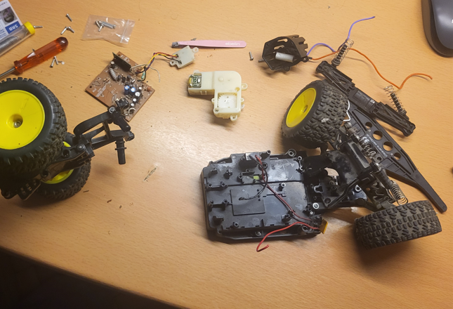
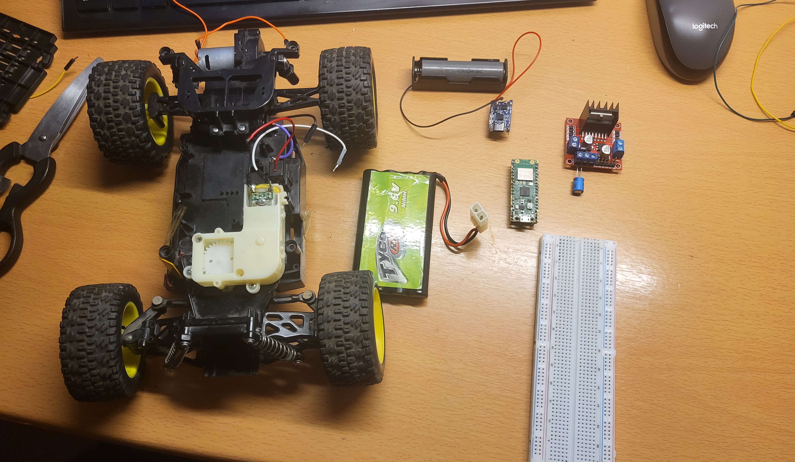
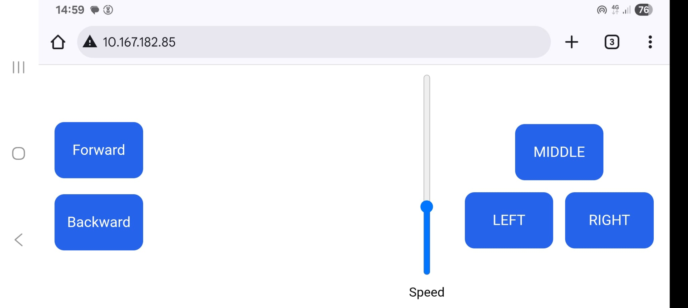
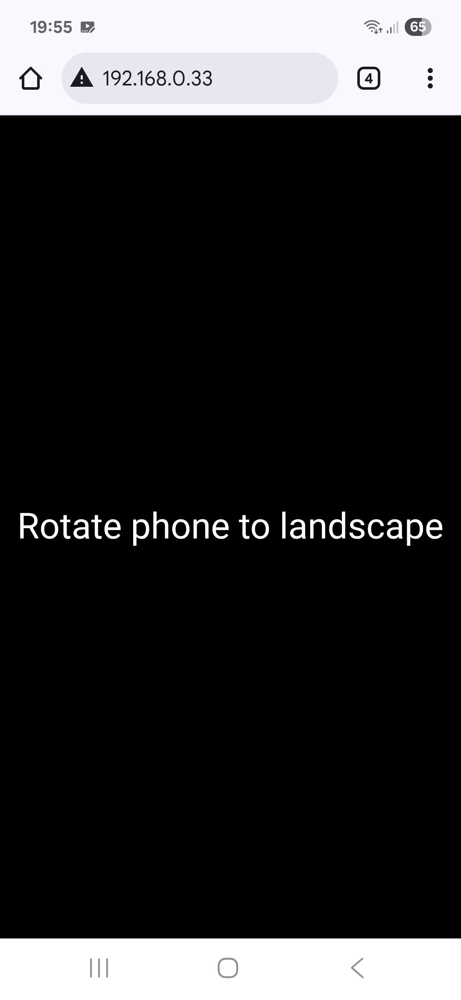

# Raspberry-pi-pico-W-controlled-RC-car 
This project is a Wi-Fi controlled RC car based on the Raspberry Pi Pico W. The car can be controlled remotely via a web interface hosted on the Pico W. Motor direction and speed are controlled using an L298N motor driver, while wireless communication is handled by the Pico W’s built-in Wi-Fi module.

The chassi of the car used to belong to a RC hot wheels car, but the electronics broke years back, which motivated me to makes this car work via using a microcontroller and other hardware!

  

## Hardware Used
- Raspberry Pi Pico W
- TP4056 Li-Ion battery charging module
- Single-cell Li-Ion battery (3.0–4.2 V)
- L298N dual H-bridge motor driver
- 2 × DC motors
- 1 × electrolytic capacitor (L298N supply decoupling)
- 2 × ceramic capacitors (DC motor noise suppression)
- 9.6 NiMH battary for DC motors

  

## Wiring connections 

<table align="left">
  <tr><th colspan="2">Pico W → L298N</th></tr>
  <tr><td>GP0</td><td>IN1</td></tr>
  <tr><td>GP1</td><td>IN2</td></tr>
  <tr><td>GP2</td><td>ENA</td></tr>
  <tr><td>GP3</td><td>IN3</td></tr>
  <tr><td>GP4</td><td>IN4</td></tr>
  <tr><td>GP5</td><td>ENB</td></tr>
</table>

<table align="left" width="20"></table>

<table align="left">
  <tr><th colspan="2">NiMH → L298N</th></tr>
  <tr><td>NiMH +</td><td>12V</td></tr>
  <tr><td>NiMH −</td><td>GND</td></tr>
</table>

<table align="left" width="20"></table>

<table align="left">
  <tr><th colspan="2">Li-Ion → TP4056</th></tr>
  <tr><td>Li-Ion +</td><td>B+</td></tr>
  <tr><td>Li-Ion −</td><td>B−</td></tr>
</table>

<table align="left" width="20"></table>

<table align="left">
  <tr><th colspan="2">TP4056 → Pico W</th></tr>
  <tr><td>B+</td><td>VSYS</td></tr>
  <tr><td>B−</td><td>GND</td></tr>
</table>

 

## Code overview

The project is written in MicroPython and is structured in a modular way to keep motor control, steering logic, and web communication separated.

### main.py
- Entry point of the application.
Initializes the motor control and steering modules, sets up the Wi-Fi connection, and starts the web server.

### steering.py
- Handles steering logic for the RC car. Controls motor direction and PWM signals to achieve left, right, and center steering.

### trajectory.py
- Handles the movement behaviour of the car. It can go upwards or backwards.

### webserver.py
- Handles the web server running on the Pico W. Serves a web-based control interface and processes incoming HTTP requests to control the car in real time.

## Control setup 

- On the left side of the screen we have controls "Upwards" and "Backwards". While we hold on of the buttons the car goes in the corresponding direction.
- On the right side of the screen we have 3 steering options and the slider which controls the cars motor speed

  

- If the phone is not in a landscape position, then a message will appear on the screen "Rotate phone to landscape"

  

## Short video of the car

  

More videos can be seen in video file

## Further improvements
- Custom PCB
- Using a WebSocket
- Better steering mechanism

   

